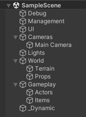
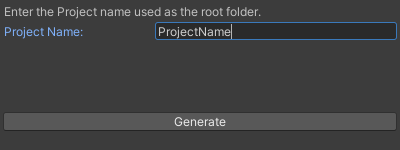
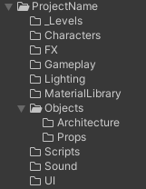

# Generate Project Structure

This package can be used to setup the structure for the file system and scene hierarchy.

The structure is based on the [Unity Style Guide](https://github.com/justinwasilenko/Unity-Style-Guide) by justinwasilenko.

## How to Use
### Generate the Scene Structure
The tool is located in the scene hierarchy right-click menu under Custom Tools > Create Scene Structure.

Executing the tool will generate empty game objects in the hierarchy to be used as "folders" to help keep actual 
objects organized.

### Generate the Folder Structure
The tool is located in the assets right-click menu under Custom Tools > Create Folder Structure.

Executing the tool will give a prompt, asking the user to provide the project name. This is what the root level folder
of the folder structure will be called. By default, it is the `Product Name`. 

Clicking the `Generate` button will generate the folder structure under the "Assets" directory.

